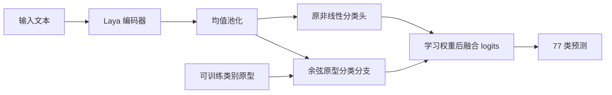

# Banking77 模型结构改动实验

本轮按验证集选中 **semantic**。官方测试集准确率 **93.70%**，macro-F1 **93.71%**。 结构改动版本未达到超过 94% 的阶段目标。 **同轮数普通训练对照达到 94.09%，已经超过 94%，但收益不能归因于新增结构。**
相对旧分类头的 93.80%，本轮没有提高测试准确率。验证集提升未能转化为测试集提升，应记录为未成功的结构改动实验。旧模型和推荐链接均保留原状。

## 实际改动

以 Laya 编码器 + ModernBERT 分类头为起点，增加可训练的余弦类别原型分支。
原分类头利用其原有池化方式；原型分支利用全部非填充 token 的均值表示。
融合公式为 `logits = original_logits + sigmoid(gate) * exp(scale) * cosine(mean_hidden, prototypes)`。
原型、融合系数、温度和编码器共同训练，推理仍只运行一个编码器。
新增可训练参数 78,850 个；没有增加第二套编码器。

prototype 组从训练样本各类别的平均表示初始化；semantic 组额外混入 20% 类别名称表示。
训练目标为融合 logits 的交叉熵，加 0.2 倍原型交叉熵和 0.01 倍余弦锚点约束。
control 组仅继续普通分类训练，用于区分新增结构的收益和额外训练的收益。
这是模型结构改动和已有技术的组合，**没有宣称已证明论文级新颖性**。
该模型使用固定的 77 类分类接口，不是原生 Laya 的可变候选决策头。



## 验证集消融

三组使用同一个仅见过 8,502 条训练样本的初始 checkpoint。
验证集 1,501 条；最多追加 4 个 epoch，seed=42，编码器学习率 5e-6，
头部学习率 5e-5，实际 batch=32，micro-batch=16，weight decay=0.01，warmup=0.1。
使用 NVIDIA L20、BF16 自动混合精度、AdamW 和线性学习率调度；完整依赖版本见复现包。
按验证 accuracy 选模型及 epoch，同分看 macro-F1。

| 结构 | 验证 accuracy | 验证 macro-F1 | 追加 epoch |
|---|---:|---:|---:|
| 原分类头，不追加训练 | 91.27% | 91.22% | 0 |
| control | 91.61% | 91.62% | 2 |
| prototype | 91.87% | 91.76% | 2 |
| semantic | 92.14% | 92.02% | 4 |

原生 Laya 的历史最佳验证 accuracy 为 91.61%，使用不同结构和训练设置，单独列为参考。

## 官方测试结果

| 模型 | Accuracy | Macro-F1 |
|---|---:|---:|
| 之前的原生 Laya 微调 | 93.44% | 93.42% |
| 之前的 Laya 编码器 + 普通分类头 | 93.80% | 93.81% |
| 同轮数普通训练对照 | 94.09% | 94.09% |
| 本轮 semantic | 93.70% | 93.71% |

相对旧分类头，纠正 15 条，新增错误 18 条，正确预测数净变化 -3 条。配对精确 McNemar 检验 p=0.7283。该检验不能替代多随机种子实验。

相对同轮数普通训练对照，纠正 11 条，新增错误 23 条，正确预测数净变化 -12 条；配对精确 McNemar p=0.0576。 该比较未达到常用的 0.05 显著性门槛，当前结果应视为初步证据。

选定方案后，从原有全量训练 7 个 epoch 的分类器起点，使用全部 10,003 条训练样本
重建原型，并追加选定 epoch 数量。测试集为完整 3,080 条，每类 40 条。
原有测试分数此前已经查看，因此本轮是探索性后续实验，不能称作从未接触测试结果的确认实验。
本轮未利用测试样本、标签或错误构建原型；模型选择在新测试评估前写入 selection_before_test.json。
新测试结果不用于开启进一步搜索。重新加载 checkpoint 的逐条预测一致；accuracy/F1 独立重算通过。
同轮数普通训练对照在新测试评估前预先规定，使用同一起点、同样追加 4 个 epoch、
相同学习率与 batch，仅关闭原型分支和相应辅助损失。该对照用于归因分析，不改变验证集选定的主模型。
当前只有一个训练种子；尚不能证明跨种子稳定性，也没有外部榜单提交。

## 与榜单分数的关系

94.09% 是官方公开 test split 上的本地结果，不是已经认证的外部榜单成绩。
普通训练对照已用标准 `AutoModelForSequenceClassification` 独立加载导出文件复核，
3,080 条预测与实验评估逐条一致，见 STANDARD_EXPORT_VERIFIED.json。
复现设置：完整 test split、原标签映射、max_length=128、batch=16、BF16、SDPA，
tokenizer 与权重均从同一 checkpoint 加载。

若目标榜单允许全量监督微调并采用相同测试集与评估规则，该结果具有可复现依据。
隐藏测试集、少样本/零样本设置、不同数据版本或推理规则，均不能直接套用本分数。
具体榜单尚未指定，因此没有宣称榜单等价性；上传模型本身也不等于获得榜单认证。
94.09% 来自预先指定的普通训练对照，原型改动的验证选定主模型仍为 93.70%。

可在原服务器复核标准导出模型：

```sh
cd /opt/laya-banking77
CUDA_VISIBLE_DEVICES=0 venv/bin/python verify_standard_export.py
```

## 方法定位与已有工作

类别原型和归一化余弦分类已有明确先例，例如
[Prototypical Networks](https://arxiv.org/abs/1703.05175) 与
[CosFace](https://arxiv.org/abs/1801.09414)。本轮实现采用可训练原型、残差融合和训练期辅助损失，
没有实现 CosFace 的余弦间隔，也不是其复现实验。
现阶段适合作为有结构改动、有消融的技术报告；论文的新颖性和稳定性仍需进一步验证。

## 文件与复现

服务器目录 `/opt/laya-banking77/research_v2`。
验证集选定的实验 checkpoint：`/opt/laya-banking77/research_v2/full_train_semantic/best`。
94% 以上普通训练对照的标准 Transformers checkpoint：`/opt/laya-banking77/research_v2/matched_control/best/backbone`。
所有实验配置、逐轮日志、选择依据、测试预测和权重 SHA256 均保存在此目录。
旧模型和结果没有覆盖。可复现包包含本轮代码及旧轮基础包，不包含大型模型权重。

在原服务器的 `/opt/laya-banking77` 目录运行：

```sh
# 复核已保存模型；只读取 checkpoint，写入独立评估目录。
CUDA_VISIBLE_DEVICES=0 venv/bin/python prototype_train.py evaluate \
  --checkpoint /opt/laya-banking77/research_v2/full_train_semantic/best \
  --split test --name user_reproduction
```

从旧轮训练起点重跑本轮获选方案：

```sh
CUDA_VISIBLE_DEVICES=0 venv/bin/python prototype_train.py train \
  --variant semantic --name rerun_validation --epochs 4 --seed 42
CUDA_VISIBLE_DEVICES=0 venv/bin/python prototype_train.py train \
  --variant semantic --name rerun_full --full-train \
  --source /opt/laya-banking77/classifier_runs/encoder_full_train/best \
  --epochs 4 --seed 42
# 重跑相同轮数的普通训练对照
CUDA_VISIBLE_DEVICES=0 venv/bin/python prototype_train.py train \
  --variant control --name rerun_control --full-train \
  --source /opt/laya-banking77/classifier_runs/encoder_full_train/best \
  --epochs 4 --seed 42
```

初始化模型、训练数据、隔离环境的复现方法见旧轮 README/RESULTS。
部署时将 prototype_model.py 放在 Python 路径中，使用
`PrototypeClassifier.from_pretrained(checkpoint)`，tokenizer 从 `checkpoint/backbone` 读取。
该类支持标准 Transformers 编码器和 tokenizer；额外分支单独保存在 safetensors 中。
