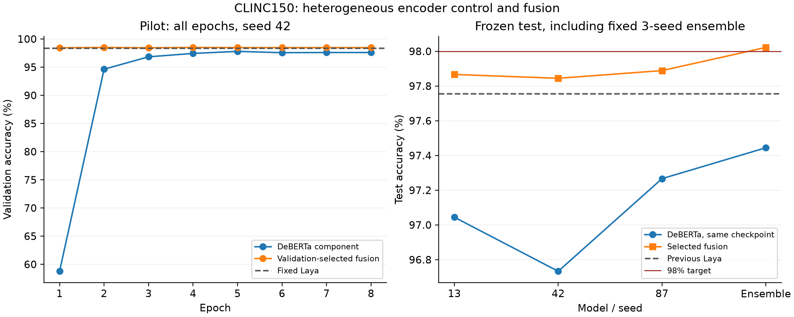

# CLINC150 异构编码器对照与混合实验

冻结选择的结果：**Laya + DeBERTa 混合系统，测试准确率 98.0222%**。
超过 98% 的实测目标。
选择类型 `ensemble`，Laya 概率权重 0.5。

该结果不是 Laya 单编码器结构改进。使用不同预训练底座和更多推理计算必须明确归因。
若 Laya 权重为零，则没有 Laya 参与预测，必须称为 DeBERTa 对照。

## 完整结果

| 运行 | 同权重 DeBERTa 分量测试 | 验证选中的融合测试 | Laya 权重 |
|---|---:|---:|---:|
| deberta_13 | 97.0444% | 97.8667% | 0.5 |
| deberta_42 | 96.7333% | 97.8444% | 0.75 |
| deberta_87 | 97.2667% | 97.8889% | 0.5 |
| 固定等权集成 | 97.4444% | 98.0222% | 0.5 |

原 Laya rdrop_42 测试为 97.7556%。DeBERTa 分量使用与对应混合系统完全相同的权重，便于区分融合贡献。
这些 DeBERTa checkpoint 按混合系统验证 accuracy/NLL 选择；不是另外按单独 DeBERTa 最优验证分数选出的基线。
选中系统相对原 Laya 净变化 +0.2667 个百分点，修正 17 条、退步 5 条。
配对 bootstrap 95% 区间 [0.0667, 0.4667] 个百分点，exact McNemar p=0.016901，未校正多重比较。

相对同权重 DeBERTa 分量，加入 Laya 的净变化为 +0.5778 个百分点，修正 42 条、退步 16 条。
对应条件区间 [0.2444, 0.9111] 个百分点；exact McNemar p=0.000862。

全部运行融合测试均值 97.8667%。
种子样本标准差 0.0222 个百分点。

不同种子的混合系统共享同一个固定 Laya 模型；这不是三次完全独立的端到端系统训练。配对区间条件于已训练权重，不覆盖全部训练随机性或多轮选择偏差。

## 协议和归因

原始 15000 train / 3000 validation / 4500 test，150 类闭集，排除 OOS。没有合并训练和验证集，没有引入生成文本或外部意图标注。
先导 seed 42，验证选中的独立/混合候选优于原 Laya 验证 98.4% 才补训 seeds 13/87。
通用预训练 DeBERTa-v3-large：mean pooling、dropout .1、150 类线性头，CE + .1 SupCon；batch 16，累积 4，最大长度 64，8 epochs。
encoder LR 1e-5、head LR 1e-4、AdamW weight decay .01、10% warmup 后线性衰减、梯度裁剪 1、BF16。
每个 microbatch 内计算 SupCon；累积梯度不扩大对比损失的样本集合。
混合概率为 (1-alpha)*DeBERTa + alpha*固定 Laya，alpha={0,.25,.5,.75,1}；三种子集成固定等权，所有选择只按验证 accuracy/NLL。
模型选择在测试前冻结，不以测试最优种子替换冻结结果；完整 SHA256 和时间记录见 evaluation_freeze.json。
前三轮测试汇总已知，第四轮 Laya 原生重排器也同时开发；本实验不是独立盲测。多轮研究选择偏差仍存在。
预训练数据没有完全可审计的样本清单，无法保证没有上游基准污染。该结果是本地自测，不代表官方榜单接收或当前排名。
原 Laya、异构编码器分量和融合必须分别报告，不能把新增编码器的能力声称为 Laya 单模型创新。

## 模型文件

完整权重在服务器 `/opt/laya-clinc150/artifacts/hybrid/release_system`；本地保留代码、元数据、报告和预测证据。
```bash
cd /opt/laya-clinc150
CUDA_VISIBLE_DEVICES=0 venv-final/bin/python infer_hybrid.py --checkpoint artifacts/hybrid/release_system --text "what is my bank balance"
```

[微软官方模型卡](https://huggingface.co/microsoft/deberta-v3-large)：固定 revision `64a8c8eab3e352a784c658aef62be1662607476f`。模型卡标注 MIT 许可。
官方模型文件 SHA256：`dd5b5d93e2db101aaf281df0ea1216c07ad73620ff59c5b42dccac4bf2eef5b5`。镜像下载逐文件按官方 Git/LFS 哈希验证。
Laya 来源：[原始仓库](https://github.com/NandhaKishorM/laya)，本地实验代码保留 Apache-2.0 LICENSE。

## 最终融合与复验

本次最终方案使用 P = 0.5 × P(Laya) + (P(DeBERTa seed 13) + P(DeBERTa seed 42) + P(DeBERTa seed 87)) / 6。
总共四个神经编码器。单次融合配置的三种子均值低于 98%；达到 98.0222% 的是固定三种子集成后的系统。
4500 条中正确 4411 条；只比 98% 的边界多判对一条，不应宣传为对未知数据稳定超过 98% 的保证。

原生 Laya 重排器测试 97.6000%，未提升，见 [ROUND4_REPORT.md](ROUND4_REPORT.md)。最大间隔分类头没有验证提升，未进入测试，见 [MARGIN_REPORT.md](MARGIN_REPORT.md)。

导出权重通过实际推理 API 重跑 4500 条测试样本，准确率 98.0222%，与冻结预测差异 0 条。这一步只核对复现，没有重新选择参数。

## 推理成本

部署系统包含 4 个编码器，共 1,697,433,176 个参数。权重文件合计 6,789,898,104 字节。
NVIDIA L20 常驻前向和概率融合：batch=1、padding=64、BF16、20 次预热、100 次测量，p50 49.411 ms，p95 49.632 ms。不含加载、分词和网络。
原第二轮单模型同类协议历史 p50 为 10.104 ms；这里只是历史参照，不是同一进程下的配对性能测试。
