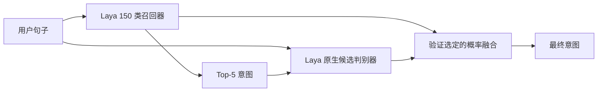
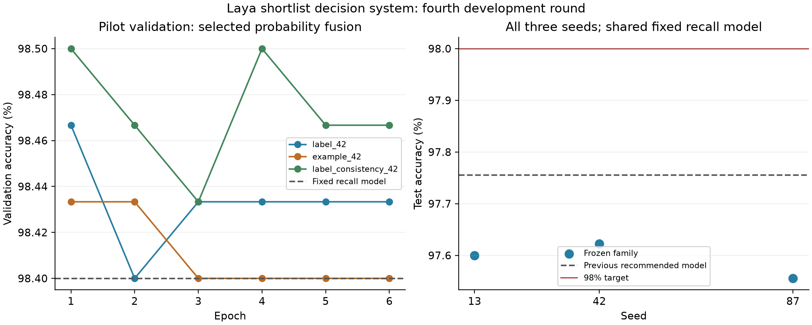

# Laya CLINC150 第四轮实验报告

目标为原始 full 划分、150 类闭集测试准确率超过 98%。已知前三轮测试汇总，本轮不是独立盲测。
模型、参数与融合选择均使用训练/验证数据，测试前冻结。不把一次自测称为正式榜单接收。

## 主要结果

| 方案 | 测试准确率 |
|---|---:|
| 第二轮推荐分类器 | 97.7556% |
| 本轮验证选出的单重排器系统 | 97.6000% |
| 本轮固定三重排器系统 | 97.6000% |
| 本轮最终验证选出的部署系统 | 97.6000% |

最终选择类型：`ensemble`；单重排器候选为 `artifacts/round4/label_consistency_13`。
本轮冻结选择的系统尚未超过 98%，不能声称目标已经完成。
“单重排器系统”包含一个召回编码器和一个重排编码器，并不是单模型推理。集成包含一个召回器和三个重排器。

相对第二轮推荐模型，净变化 -0.1556 个百分点；修正 6 条、退步 13 条。
配对 bootstrap 95% 区间 [-0.3556, 0.0222] 个百分点；exact McNemar p=0.167068（未校正多重比较）。

## 完整训练结果

| 运行 | 验证准确率 | 测试准确率 | 纯重排器测试准确率 |
|---|---:|---:|---:|
| example_42 | 98.4333% | 97.7333% | 96.3556% |
| label_42 | 98.4667% | 97.6444% | 95.0889% |
| label_consistency_13 | 98.5000% | 97.6000% | 96.4444% |
| label_consistency_42 | 98.5000% | 97.6222% | 96.4444% |
| label_consistency_87 | 98.4667% | 97.5556% | 94.8889% |

选中家族三种子均值 97.5926%，样本标准差 0.0339 个百分点。
相对同一个固定第二轮召回器的平均差值 -0.1630 个百分点，条件区间 [-0.3407, 0.0148]。
该区间条件于已训练模型，不包含所有训练随机性；召回器在三个种子中共享，不能将其视为三个完全独立端到端训练。

## 结构与训练



原分类器从 150 类召回 top-5，再使用原始 Laya DecisionModel 的 ModernBERT、两层 typed head 和 marker scorer 对五个候选联合判别。
完整原始 Laya 权重严格加载；两个先导分支分别仅给标签名称、或追加一条来自训练集的近邻示例。
训练随机置换候选，训练候选缺失金标时补入金标；验证/测试绝不注入金标。训练检索排除自身及规范化文本重复样本。
训练 6 epochs，batch 16，累积 4 步，encoder LR 1e-5，head LR 5e-5，AdamW weight decay .01，10% warmup 后线性衰减，梯度裁剪 1，BF16。
最大长度 label=128、example=256；只优化选择题 CE，冻结未使用的 act_head。
原分类器与重排器概率的混合系数候选为 0/.25/.5/.75/1，温度 .5/1/2；按验证 accuracy、再按 NLL 选 epoch 和融合配置。
先导均使用 seed 42，按验证选中的分支补训 seeds 13/87；三种子集成固定等权，没有测试后挑选子集。
在测试前增加 label_consistency 先导：两次候选排列与 dropout 前向，按意图 ID 对齐 logits 后使用对称 KL（权重 1）和平均 CE。编码器 dropout=.1。
该扩展同时改变候选顺序一致性和编码器 dropout，且每更新执行两次前向；未做等计算量归因或独立因素消融。三个先导均保留。
完整配置见 [ROUND4_PLAN.md](ROUND4_PLAN.md)，代码见 `round4.py`，冻结记录见 `artifacts/round4/evaluation_freeze.json`。

## 诊断与限制

召回器测试 top-5 recall=99.6667%；重排器不能修正 top-5 之外的候选缺失。
本轮召回器重算因 batch 设置与历史比较的预测差异为 5 条。
验证 top-5 recall 为 99.6%；两种输入在 3000 条验证查询中均未截断查询或标签名称。示例文本最多保留 24 tokens。
多轮开发存在基准选择偏差；只能把冻结协议下的结果作为实测证据，不能声称独立盲测或当前全榜排名。
检索、重排、候选选择均是已有思路；本项目贡献应描述为 Laya 上的具体结构适配及其受控实验，不应将通用方法声称为原创。
基础模型预训练数据不完全公开，无法排除上游基准污染。新结构推理与存储成本更高，不能与单编码器宣称等成本。

## 文件和使用

完整部署权重：服务器 `/opt/laya-clinc150/artifacts/round4/release_system`。本地保留代码、元数据、统计和预测证据，未复制大权重。
```bash
cd /opt/laya-clinc150
CUDA_VISIBLE_DEVICES=0 venv-final/bin/python infer_round4.py --checkpoint artifacts/round4/release_system --text "what is my bank balance"
```

结构来源：[Laya 原始代码](https://github.com/NandhaKishorM/laya)，固定上游 commit 42626c348753fbb17572a813127df2278a1ec527。
数据来源：[CLINC150 官方仓库](https://github.com/clinc/oos-eval)，固定划分 SHA256 见冻结记录。

## 保留负结果

本路线的冻结测试结果不支持替换原 Laya 推荐模型。另一个明确增加 DeBERTa 编码器的异构实验达到 98.0222%，见 [HYBRID_REPORT.md](HYBRID_REPORT.md)，不能将其成绩归到本重排器结构。


单重排器系统前向 p50 20.025 ms，三重排器系统 p50 41.201 ms。L20、batch=1、BF16；固定预分词候选，不含加载、分词、候选构建和检索。
